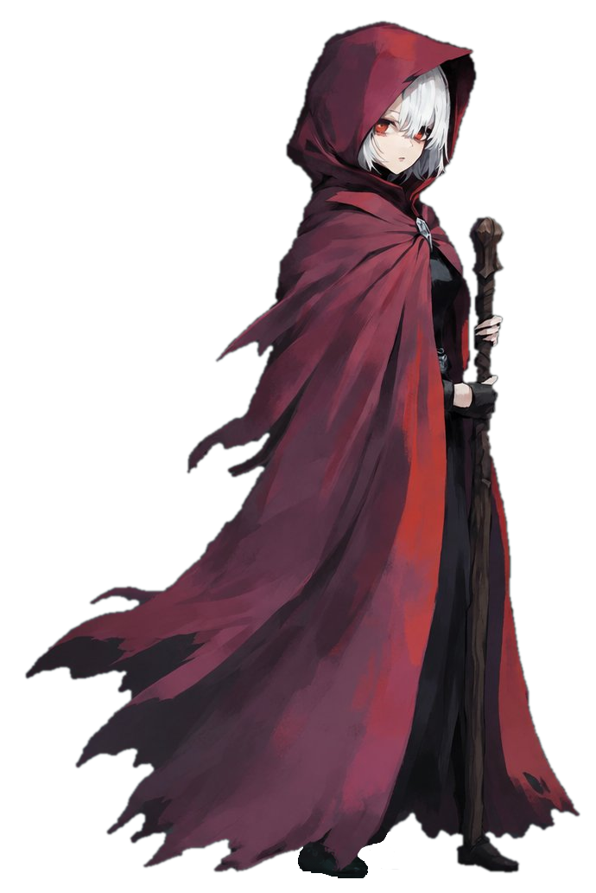
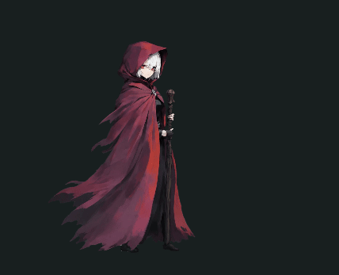

# BloodMaze — A Custom Character MOD for Slay the Spire 2

English | [日本語](README.ja.md)

**A MOD that adds a new character, "Revenant," to Slay the Spire 2.**
A blood-mage built around "MP," a custom resource you carry across combats.

  <table>
    <tr>
      <td align="center"></td>
      <td align="center"></td>
    </tr>
  </table>

---

## Overview

A MOD that adds an original character, cards, and relics to Slay the Spire 2.
Every fight forces a kind of decision the base game never asks of you: **land a powerful blow now, or save your resources for the battles ahead?**

- New character: **Revenant**
- **87 custom cards** (Attacks / Skills / Powers, across every rarity, including co-op cards)
- New buffs and debuffs
- Co-op mode supported

---

## Highlights

- **MP system** — A custom resource carried across combats. Fully implemented with persistence, UI display, and save-scumming protection.
- **Card design** — A new kind of strategy that combines "MP attacks," "Hemorrhage," and "HP manipulation."
- **87 cards** — Many trade the cost of spending MP for broadly useful, powerful effects.
- **Animated portrait** — A PNG converted into `NCreatureVisuals`, with idle / hurt / attack / die states driven by an AnimationTree.

---

## About This Project

This MOD was built solo as a way to learn game development.
The goal was to experience the whole pipeline — design, implementation, and art — while digging up first-hand information in an area with very little documentation.

---

## Design Concept

**"Resource management that spans combats"** is the heart of this MOD.

HP persists across a run, but it usually isn't a resource you spend strategically.
So I introduced **"MP" — a resource you deliberately spend across the gaps between fights.**

> You want to save MP for the boss, but you also want to use it right now —
> that dilemma becomes a decision in every single combat.

The cards are organized along two main axes:

| Card type | Cost | Upside | Downside |
|---|---|---|---|
| MP spenders | MP drained across combats | Versatile or unconditional high damage | The next fight gets harder |
| Bleed | Time and damage taken within a fight | Conserves MP | Fights drag on and play slower |

---

### Requirements

- Slay the Spire 2
- [BaseLib](https://github.com/Alchyr/BaseLib-StS2) (required dependency)

### Download

- Nexus Mods (recommended) — *coming soon*
- [GitHub Releases](https://github.com/GanbaruKing/BloodMazeMod-StS2/releases)

> ⚠️ Install MODs at your own risk. Always back up your save data before installing (Step 1).

### Steps

1. **Back up your save data (required)**
   To avoid corrupting your normal save, copy your save data first.
   Copy the `save` folder inside `C:\Users\<username>\AppData\Roaming\SlayTheSpire2\Steam\<string of numbers>\profile`,
   then create `modded\profile\` inside the `<string of numbers>` folder and paste it there.

2. **Create a `mods` folder**
   In Steam, right-click Slay the Spire 2 → "Manage" → "Browse local files" to open the game folder,
   and create a `mods` folder inside it if one doesn't already exist.

3. **Place the MOD**
   Download the latest version from one of the links above, then copy the extracted files into the `mods` folder.

4. **Launch the game**
   On startup you'll see a message that the MOD was detected. Approve it, and Revenant becomes playable.

---

## Credits / Tools

- [BaseLib](https://github.com/Alchyr/BaseLib-StS2) — Library for STS2 MOD development
- [ModTemplate-StS2](https://github.com/Alchyr/ModTemplate-StS2) — Used as the foundation for project structure and setup
- [Harmony](https://github.com/pardeike/Harmony) — Runtime patching
- Godot Engine — Scenes and animation
- Midjourney — Card art and portrait generation
- GIMP — Art editing and rework
- Reference MOD: [Oddmelt](https://github.com/Alchyr/Oddmelt)

---

## About the Art

The artwork in this project is AI-assisted.
I understand that AI-assisted art is not for everyone, but I put genuine effort and care into every visual asset in this project.

---

## Acknowledgments

This MOD would not exist without [BaseLib](https://github.com/Alchyr/BaseLib-StS2) and [ModTemplate-StS2](https://github.com/Alchyr/ModTemplate-StS2), developed and shared by [Alchyr](https://github.com/Alchyr) and the other contributors.
In the sparsely documented world of STS2 MOD development, these libraries and templates were the very foundation of my work, and I learned a great deal from their careful craftsmanship.
I'm also deeply grateful to the STS2 modding community for generously sharing implementation examples and knowledge.
My heartfelt thanks to everyone who laid the groundwork and shared what they knew.

*Special thanks to [Alchyr](https://github.com/Alchyr) and all the contributors behind BaseLib and ModTemplate-StS2, as well as the STS2 modding community. This mod would not have been possible without them.*

---

## License

This project is licensed under the MIT License - see the [LICENSE](LICENSE) file for details.
